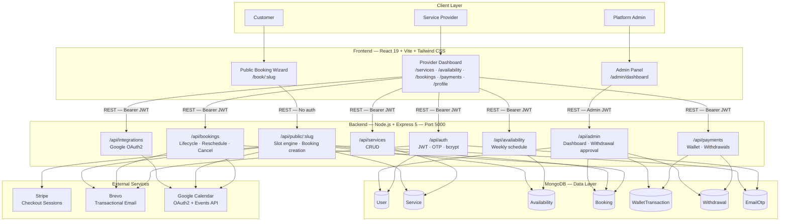
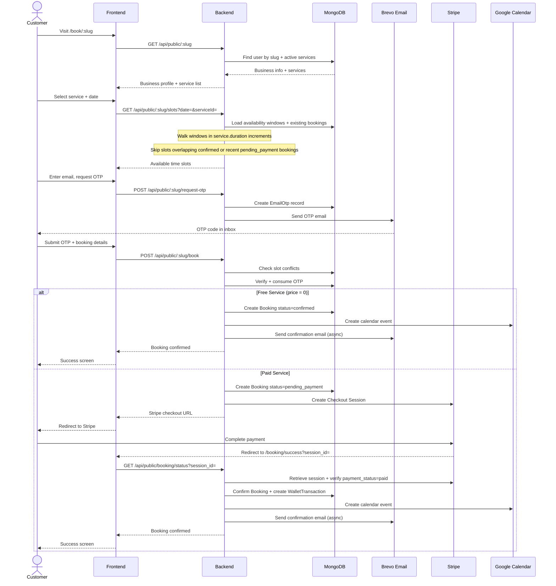
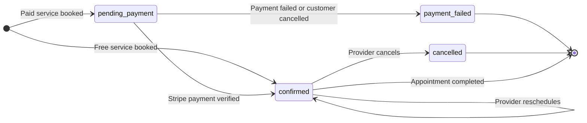
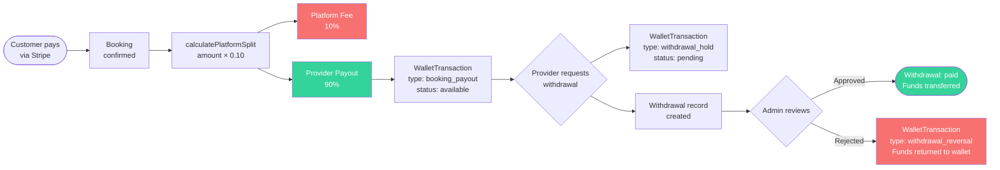

# BookOps — Multi-Tenant Booking & Payments Platform

**BookOps** is a full-stack SaaS platform that lets service providers publish a public booking page, manage services and availability, accept OTP-verified bookings, and receive automated wallet-based payouts — with optional Stripe payments and Google Calendar sync.


---

## What It Does

Each provider signs up, gets a unique public URL (`/book/your-slug`), and can:

- Define **services** with custom duration, price, and description
- Set **weekly availability** windows per day
- Accept **bookings** from clients via a zero-login public booking page
- Require **OTP email verification** for both registration and booking
- Collect **Stripe payments** with automated 90/10 platform fee splits
- Track **earnings** in a wallet ledger and request withdrawals
- Sync bookings to **Google Calendar** automatically

---

## System Architecture



---

## Tech Stack

| Layer | Technology |
|---|---|
| Frontend | React 19, Vite 8, Tailwind CSS v4, React Router v7 |
| Backend | Node.js, Express 5, Mongoose 9 |
| Database | MongoDB |
| Auth | JWT (jsonwebtoken), bcryptjs |
| Payments | Stripe Checkout |
| Email & OTP | Brevo (Sendinblue) Transactional API |
| Calendar | Google Calendar API (googleapis) |
| Deploy | Vercel (frontend), any Node host (backend) |

---

## Key Engineering Details

### 1. Public Booking Flow

The end-to-end flow from a customer visiting a provider's page to a confirmed booking:



---

### 2. Booking Lifecycle State Machine

Every booking moves through a defined set of states. Provider actions and payment events drive transitions:



---

### 3. Wallet & Payment Pipeline

Every paid booking flows through an automated earnings pipeline. Platform takes 10%, provider keeps 90%:



---

### 4. Slot Generation Algorithm

How available time slots are computed for a given provider, service, and date:

```mermaid
flowchart TD
    A(["GET /slots?date=&serviceId="]) --> B["Load provider availability\nfor dayOfWeek"]
    B --> C{"Availability\nexists?"}
    C -->|"No"| D(["Return empty slots"])
    C -->|"Yes"| E["Load existing bookings\nfor that date"]
    E --> F["Filter: status=confirmed OR\nstatus=pending_payment AND age < 30min"]
    F --> G["For each availability window:\ncursor = window.startTime"]
    G --> H{"cursor + duration\n<= window.endTime?"}
    H -->|"No"| I{"More windows?"}
    I -->|"Yes"| G
    I -->|"No"| J(["Return available slots"])
    H -->|"Yes"| K["Candidate slot:\nstartTime=cursor\nendTime=cursor+duration"]
    K --> L{"Overlaps any\nexisting booking?"]
    L -->|"Yes — skip"| M["cursor += duration"]
    L -->|"No — available"| N["Add to slots list"]
    N --> M
    M --> H
```

---

## Getting Started

### Prerequisites

- Node.js 18+
- MongoDB (local or Atlas)
- npm

### 1. Clone the repo

```bash
git clone https://github.com/akphp7/BookOps.git
cd BookOps
```

### 2. Setup the backend

```bash
cd backend
npm install
cp .env.example .env   # Fill in your values
npm start
```

Backend runs at `http://localhost:5000`

### 3. Setup the frontend

```bash
cd frontend
npm install
npm run dev
```

Frontend runs at `http://localhost:5173`

---

## Environment Variables

Create `backend/.env` using the table below:

| Variable | Required | Description |
|---|---|---|
| `JWT_SECRET` | ✅ | Secret key for signing JWTs |
| `MONGO_URI` | ✅ | MongoDB connection string |
| `ADMIN_EMAIL` | ✅ | Admin portal login email |
| `ADMIN_PASSWORD` | ✅ | Admin portal login password |
| `STRIPE_SECRET_KEY` | Optional | Enables paid bookings via Stripe |
| `BREVO_API_KEY` | Optional | Enables OTP and booking emails |
| `BREVO_SENDER_EMAIL` | Optional | From address for emails |
| `BREVO_SENDER_NAME` | Optional | From name for emails |
| `GOOGLE_CLIENT_ID` | Optional | Enables Google Calendar sync |
| `GOOGLE_CLIENT_SECRET` | Optional | Google OAuth secret |
| `GOOGLE_REDIRECT_URI` | Optional | Google OAuth callback URL |
| `CLIENT_URL` | Optional | Frontend URL for Stripe redirects (default: `http://localhost:5173`) |

> Stripe, Brevo, and Google Calendar are all optional. The core booking flow works without them (free services only).

---

## API Overview

| Method | Endpoint | Auth | Description |
|---|---|---|---|
| POST | `/api/auth/register/request-otp` | — | Send registration OTP |
| POST | `/api/auth/register` | — | Create provider account |
| POST | `/api/auth/login` | — | Login, returns JWT |
| GET | `/api/auth/me` | JWT | Get current user |
| GET/POST/PATCH/DELETE | `/api/services` | JWT | Service CRUD |
| GET/PUT | `/api/availability` | JWT | Weekly schedule |
| GET/PATCH | `/api/bookings` | JWT | List and manage bookings |
| GET/POST/PUT | `/api/payments` | JWT | Wallet, withdrawals, payout details |
| GET | `/api/public/:slug` | — | Public business + services |
| GET | `/api/public/:slug/slots` | — | Available slots for date + service |
| POST | `/api/public/:slug/book` | — | Create a booking |
| GET | `/api/admin/dashboard` | Admin | Platform stats + withdrawals |

---

## Project Structure

```
BookOps/
├── backend/
│   ├── controllers/        # Request handlers
│   ├── models/             # Mongoose schemas
│   ├── routes/             # Express routers
│   ├── middleware/         # JWT auth, admin auth
│   ├── utils/              # Slot generator, wallet, Stripe, email, etc.
│   ├── config/             # DB connection
│   └── server.js           # Entry point
│
├── frontend/
│   └── src/
│       ├── pages/          # 12 route-level page components
│       ├── admin/          # Admin dashboard + login
│       ├── components/     # Shared layout components
│       ├── api/            # Axios API service files
│       └── context/        # Toast notifications context
│
└── docs/                   # Setup guides for Stripe, Brevo, Google Calendar
```

---

## Optional Integrations Setup

| Integration | Guide |
|---|---|
| Google Calendar | [docs/google-calendar-setup](docs/google-calendar-setup/README.md) |
| Stripe Payments | [docs/stripe-setup](docs/stripe-setup/README.md) |
| Brevo Email | [docs/brevo-setup](docs/brevo-setup/README.md) |

---

## License

MIT
